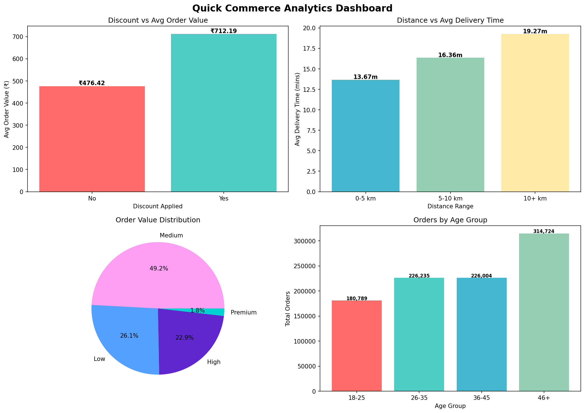

# Quick Commerce ETL Pipeline

A data engineering project that builds an end-to-end ETL pipeline
using a Quick Commerce dataset from Kaggle with 947,752 orders.

---

## Project Overview

This project simulates a real-world data engineering workflow:

- Extract data from Kaggle (947,752 orders)
- Transform it into a star schema data model
- Load it into a SQLite database
- Analyze it with SQL queries to answer business questions

---

## Tech Stack

- Python
- Pandas
- SQLite
- Matplotlib
- Kaggle API

---

## Data Model (Star Schema)

```
fact_orders
├── dim_customers
├── dim_delivery_partners
└── dim_promotions
```

---

## Business Questions Answered

1. What is the average delivery time?
2. Do discounts lead to higher order values?
3. Does distance affect delivery time?
4. What order value range is most common?
5. How do delivery partner ratings affect performance?
6. Which age group orders the most?

---

## Key Insights

| # | Question | Finding |
|---|----------|---------|
| 1 | Average delivery time | 16.51 mins (range: 5-40 mins) |
| 2 | Discounts vs order value | Discounted orders average 50% higher value (712 vs 476) |
| 3 | Distance vs delivery time | Longer distance = longer delivery (13.67 to 19.27 mins) |
| 4 | Most common order range | Medium orders (300-800) dominate at 49.1% |
| 5 | Delivery partner performance | All partners perform consistently (~16.5 mins) |
| 6 | Top ordering age group | 46+ age group leads with 314,724 orders |

---

## How to Run

1. Clone the repo
   ```bash
   git clone https://github.com/JoemarDeVera/quick-commerce-pipeline.git
   cd quick-commerce-pipeline
   ```

2. Install dependencies
   ```bash
   pip install kagglehub pandas matplotlib
   ```

3. Run the pipeline
   ```bash
   python pipeline.py
   ```

---

## Project Structure

```
quick-commerce-pipeline/
├── extract.py          - Pull data from Kaggle
├── transform.py        - Clean and model into star schema
├── load.py             - Load into SQLite database
├── pipeline.py         - Run full ETL pipeline
├── analysis.ipynb      - SQL queries and visualizations
└── quick_commerce_dashboard.png
```

---

## Dashboard


